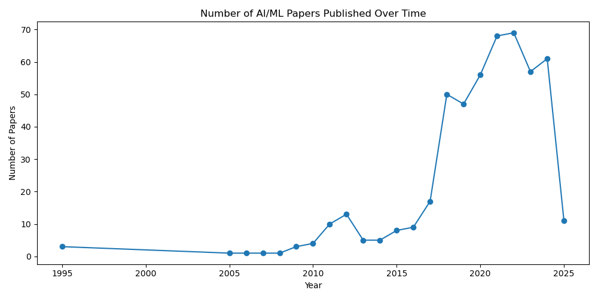
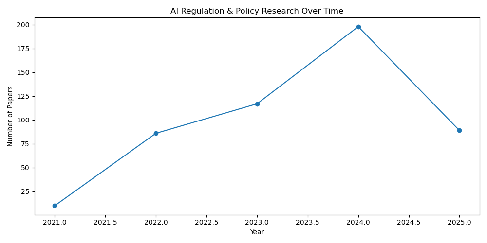
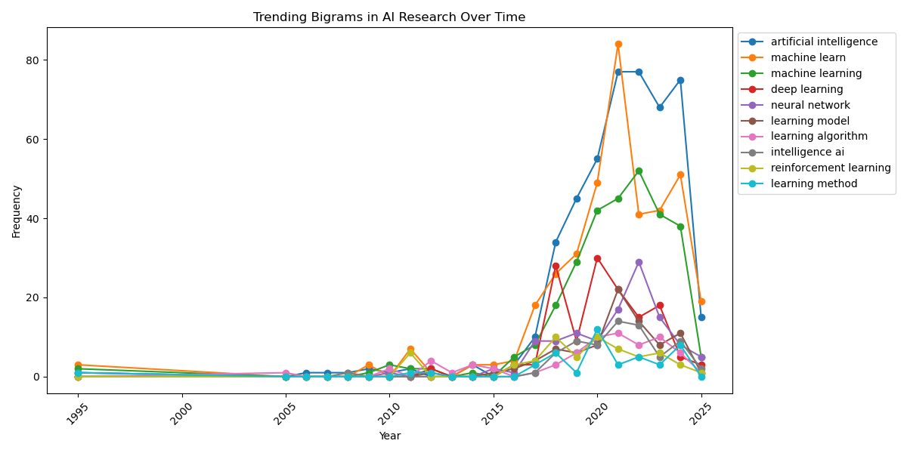

# AI Research Trends Analysis 📊  

## Overview  
This project analyzes AI research trends using arXiv data. The analysis covers:  
✅ AI/ML research growth over time.  
✅ Trends in AI regulation & policy research.  
✅ Most frequently occurring bigrams in AI research papers.  

## Features  
- **arXiv API integration**: Fetches AI-related research papers.  
- **Preprocessing**: Uses `spaCy` and `NLTK` to clean text data.  
- **Topic Modeling**: Applies **Latent Dirichlet Allocation (LDA)** to extract key AI topics.  
- **Trend Analysis**: Plots AI research growth and AI policy discussions over time.  
- **N-gram Analysis**: Identifies trending **bigrams** in AI abstracts.  

## Visualizations  
📈 **AI Research Trend**  
  

📈 **AI Policy Research Trend**  
  

📈 **Trending AI Research Terms**  
  

## Technologies Used  
- **Python**
- **arXiv API**
- **NLTK & spaCy** (Text Preprocessing)
- **Scikit-learn** (LDA Topic Modeling)
- **Matplotlib & Seaborn** (Visualization)
- **Pandas** (Data Handling)

## Installation  
1️⃣ Clone the repo:  
   ```sh
   git clone [GitHub Link]
   cd AI-Research-Trends
